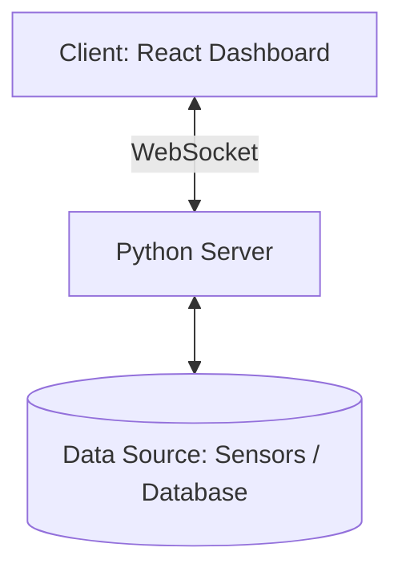

# Real‑Time Dashboard


## 🔧 Подготовка окружения

### Активация виртуального окружения

- **Windows**
  ```powershell
  venv\Scripts\Activate.ps1
  ```
- **Linux / macOS**
  ```bash
  source venv/bin/activate
  ```

### Деактивация

```bash
deactivate
```

### Управление зависимостями

- Зафиксировать зависимости:
  ```bash
  pip freeze > requirements.txt
  ```
- Установить зависимости:
  ```bash
  pip install -r requirements.txt
  ```

---

## 🖥️ Frontend

- **React**
- **Recharts**
- **react-use-websocket**

## ⚙️ Backend

- **FastAPI**
- **WebSockets**
- **Uvicorn**

---

## 📐 Архитектура



---

## 🚀 Запуск проекта

### Сервер

```bash
uvicorn main:app --reload --host 0.0.0.0 --port 8000
```

### Клиент (UI)

```bash
cd dashboard-client
npm install
npm start
```
